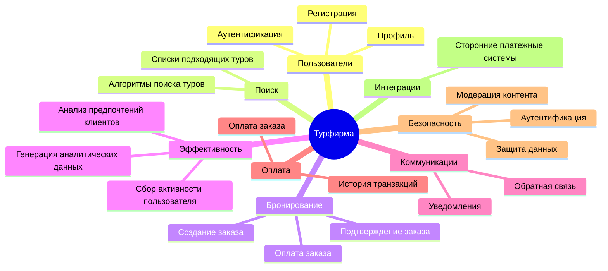
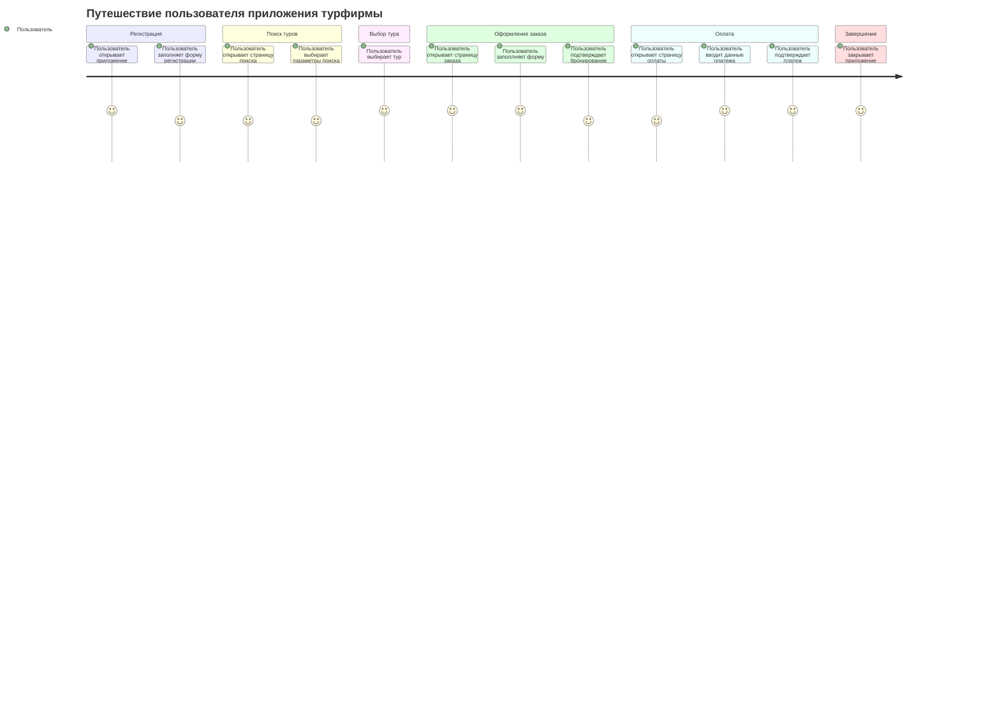
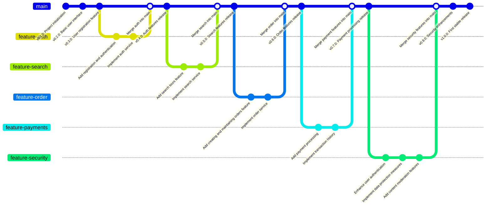

# Документирование приложения турфирмы

## 1. Структура функциональных возможностей (Mind Map)



### Описание:

Эта диаграмма иллюстрирует структуру функциональных возможностей приложения.

## Основные узлы и их значение:

* <u>Пользователи</u> функционал авторизации и управления аккаунтом

* <u>Защита данных</u> безопасность приложения.

* <u>Поиск</u> процессы поиска туров по выбранным параметрам

* <u>Бронирование</u> процессы бронирования и оплаты туров


## 2. Диаграмма путешествия пользователя (User Journey Diagram)

### Описание:

Диаграмма описывает ключевые этапы взаимодействия пользователя с системой:

* Регистрация: пользователь вводит данные и проходит аунтефикацию

* Поиск туров: пользователь выбирает параметры поиска

* Выбор тура: переход на страницу тура

* Оформление заказа: создание заказа на конкретный тур

* Оплата: оплата брони тура

## 3. Квадрант-граф (Prioritization Quadrant)

```mermaid
quadrantChart

    title Приоритеты разработки функциональности

    x-axis Easy --> Hard

    y-axis Low Priority --> High Priority

    "Авторизация": [0.8, 0.8]

    "Поиск туров": [0.4, 0.75]

    "Создание заказов": [0.6, 0.85]

    "Оплата заказа": [0.6, 0.9]

    "Обратная связь": [0.6, 0.2]

    "Модерация контента": [0.4, 0.8]

    "Защита данных": [0.8, 0.7]

    "Оптимизации поисковых систем": [0.3, 0.3]
```
Квадрант-граф помогает приоритизировать разработку функций системы. Каждая точка соответствует функционалу:

* Ось X: сложность реализации (от простого к сложному).

* Ось Y: приоритет для пользователей (от низкого к высокому).


# 4. Гит граф (Gitgraph)



### Описание:

 Гит-граф показывает процесс разработки системы через версии:

1. Основная ветка (main): стабильные версии системы.

2. Функциональные ветки: каждая ветка посвящена отдельной функциональности.

3. Слияния: после завершения работы над веткой, изменения интегрируются в main.
